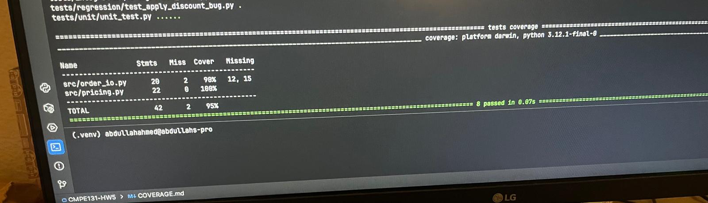

**Summary of Coverage Results:**

**Missing Lines:**

Lines 12 and 15 weren't covered in order_io.py as we can see from the test results 
and those are meant to handle specific edge cases. On top of that, those line were continue(line 12) and raise ValueError("Malformed : " + ln.strip())

**Acceptable Misses:**

The missed parts that are acceptable are lines 12 and 15 which weren't covered because those are executed in rare edge cases. 
Line 12 would only run if we have an empty line in the file and line 15 would only run if a line is missing a comma or has too many fields. 

